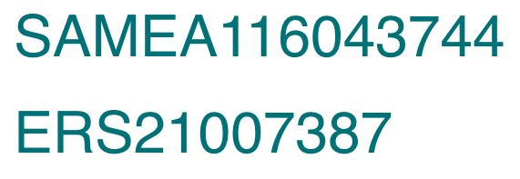

Accession Numbers
=================

Submissions to BioSamples result in accession numbers. These are a unique set of characters that identify each sample. e.g. ``SAMEA116043744``.
The unique identifier can be used to cross-reference BioSamples with other archives, such as ENA or EGA, and also serves as a permanent identifier for this sample.

BioSample accessions always begin with ``SAM``. The next letter is either ``E`` or ``N`` or ``D`` depending if the sample information was originally submitted to EMBL-EBI or NCBI or DDBJ respectively. After that, there may be an A or a G to denote an Assay sample or a Group of samples (please note Sample Group has now been deprecated). Finally there is a numeric component that may or may not be zero-padded.

Understanding these accessions can give you some information about what they refer to, even before you find them in our browser. For example, in the case of studies, samples, experiments, runs and analyses, you can identify which INSDC partner accepted the original submission by looking at the first letter: ‘E’ for ENA, ‘D’ for DDBJ, or ‘S’ for NCBI.

Example ``SAM`` and ``ERS`` accession.

BioSample accession submitted via ENA also have a redundant ENA accession beginning with ``ERS``. This is a historical holdover when ENA and BioSamples were more enmeshed, and every sample was submitted through ENA. Similarly, samples submitted via NCBI and DDBJ will have an additional unique INSDC secondary accession beginning with ``SRS`` and ``DRS``, respectively.

.. note:: We highly recommend using the SAM accession for reporting and publications.
